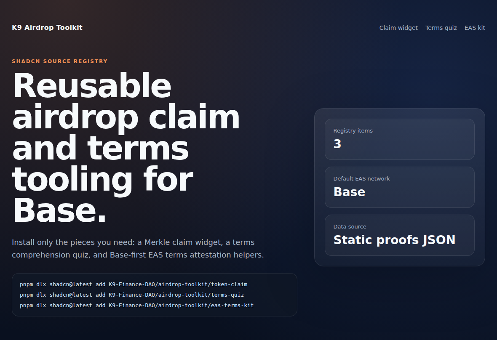
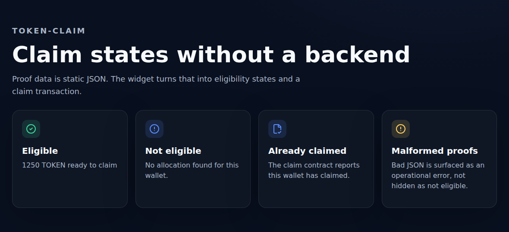
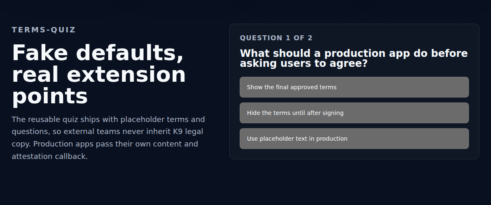
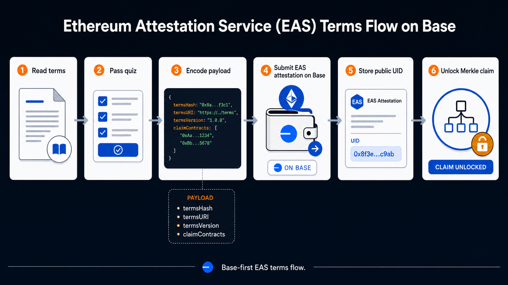
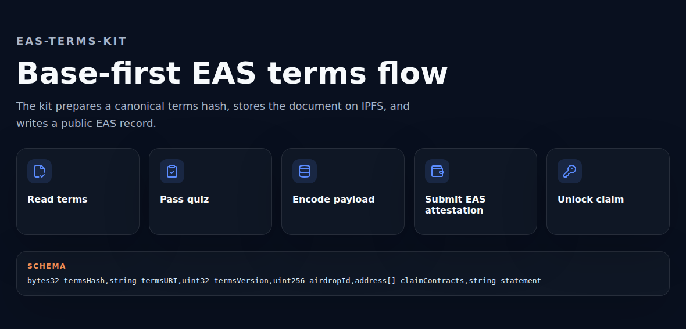

# K9 Airdrop Toolkit

Reusable shadcn source registry for Merkle airdrop claim UIs, terms comprehension flows, and EAS terms attestation tooling.

This repository is intended to be renamed from `airdrop-token-claim` to `airdrop-toolkit`. Until the GitHub repository rename is complete, install examples that use `K9-Finance-DAO/airdrop-toolkit/...` should be read as the target post-rename form.

## Live Demo

The static demo app is designed for GitHub Pages:

```bash
pnpm demo:dev
pnpm demo:build
pnpm demo:preview
```

Target demo URL after the repository rename and Pages setup:

```bash
https://k9-finance-dao.github.io/airdrop-toolkit/
```



## Registry Items

Install items independently:

```bash
pnpm dlx shadcn@latest add K9-Finance-DAO/airdrop-toolkit/token-claim
pnpm dlx shadcn@latest add K9-Finance-DAO/airdrop-toolkit/terms-quiz
pnpm dlx shadcn@latest add K9-Finance-DAO/airdrop-toolkit/eas-terms-kit
```

During the pre-rename transition, use the existing repo name:

```bash
pnpm dlx shadcn@latest add K9-Finance-DAO/airdrop-token-claim/token-claim
pnpm dlx shadcn@latest add K9-Finance-DAO/airdrop-token-claim/terms-quiz
pnpm dlx shadcn@latest add K9-Finance-DAO/airdrop-token-claim/eas-terms-kit
```

### `token-claim`

Generic single-token claim widget for an EIP-1167-style `TokenClaim` contract with static proofs JSON loading, wallet eligibility lookup, `isClaimed(address)`, `claim(uint256,bytes32[])`, and clear malformed-proof states.

Render one widget per token. For a two-token airdrop, render two instances side by side.



### `terms-quiz`

Brand-neutral terms comprehension flow with fake default terms/questions. Consumers pass their own `termsText`, `questions`, wallet adapter, and optional `onAttest` implementation.



### `eas-terms-kit`

Reusable EAS helpers and operational files:

- terms payload encoding
- Base EAS constants and Base EASScan links
- `useEasTermsAttest`
- `useHasTermsAttestation`
- terms hash/IPFS preparation script
- schema registration script
- runbook and terms template

The v1 EAS kit is Base-first by default. This keeps the install path simple for Base airdrops and avoids pretending other chains have identical explorer/indexer behavior. Advanced consumers can override EAS addresses and explorer URLs in code if they intentionally adapt the kit.





## Public Airdrop Data

The reusable toolkit does not own snapshot/proof data. Keep public allocations in a separate immutable data repository, such as:

```bash
https://github.com/K9-Finance-DAO/airdrop-data
```

Production dapps should pin proof URLs to a commit SHA:

```bash
https://raw.githubusercontent.com/K9-Finance-DAO/airdrop-data/<commit-sha>/base-mainnet/<YYYY-MM>/airdropProofs.knine.json
```

## Registry Model

This is a shadcn GitHub source registry. The CLI reads `registry.json` directly from the public repository. No GitHub Pages build output is required for v1.

## README Assets

Screenshots are generated manually, not in CI:

```bash
pnpm assets:install-browsers
pnpm assets:screenshots
```

The EAS flow diagram is a fixed generated PNG at `docs/assets/readme/eas-flow.png`. Replace it manually only when the documented flow materially changes.

## License

[MIT](./LICENSE). Copyright 2026 K9 Finance DAO.
